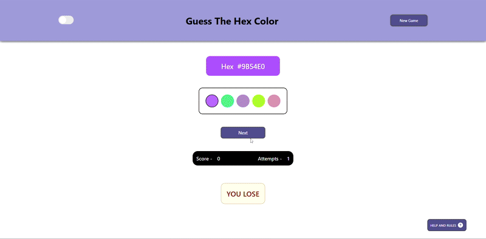
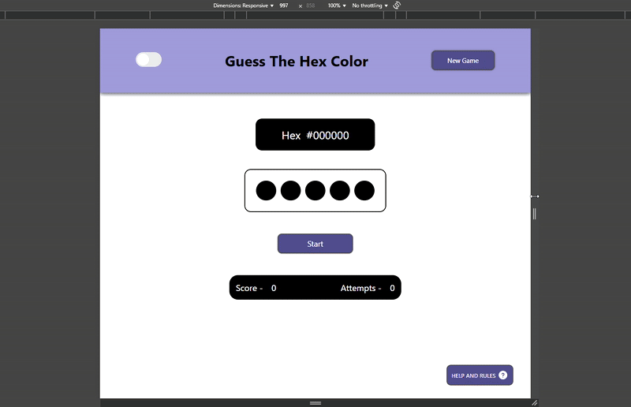
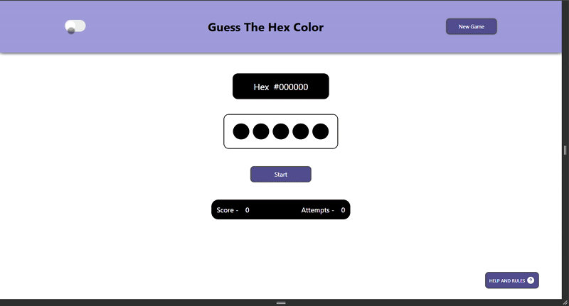
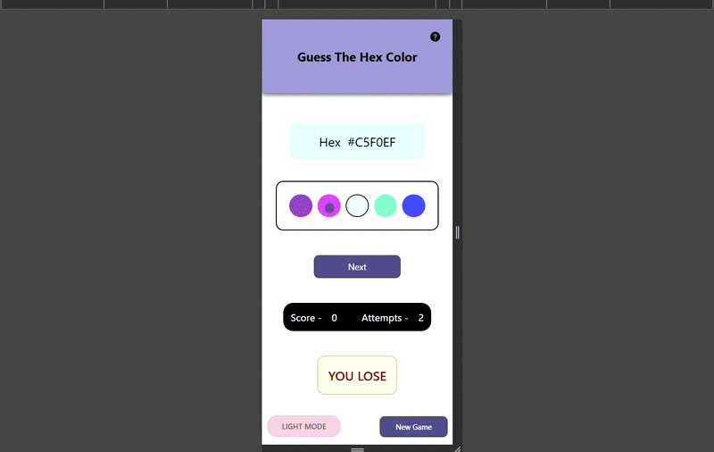
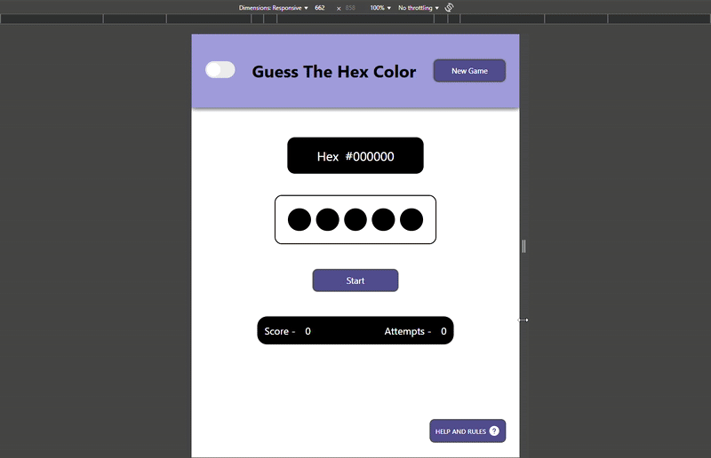

<h1>🎨 Guess The Hex Color</h1>

  This is a browser-based color guessing game where users identify the correct hex color from five options. Built using <strong>HTML</strong>, <strong>CSS</strong>, and <strong>JavaScript</strong>, the game helps strengthen visual color association and interactive UI logic. A dedicated <strong>Help Page</strong> (<code>help.html</code>) is also included to explain hex codes, game rules, and scoring in detail. Theme changes are synced across pages for a consistent experience.

<h2>🔗 Live Demo</h2>

  <a href="https://ks-fsdev.github.io/guess-the-color/" target="_blank">Play Game</a> 
  ⚠️ <em>Note: Some browsers (like Chrome) may show a security warning. This is a harmless personal project hosted via GitHub Pages for learning purposes.</em>

<h2>📸 Project Preview</h2>

<strong>Game Playthrough</strong>

<strong>Responsive View</strong>

<strong>Theme</strong>

<strong>Mobile View</strong>

<strong>Help Page</strong>

<h2>📂 Project Structure</h2>
<table>
  <thead>
    <tr>
      <th>File</th>
      <th>Description</th>
    </tr>
  </thead>
  <tbody>
    <tr>
      <td><code>index.html</code></td>
      <td>Main HTML structure and game elements</td>
    </tr>
    <tr>
      <td><code>style.css</code></td>
      <td>Styling with Flexbox, theme management, and responsiveness</td>
    </tr>
    <tr>
      <td><code>script.js</code></td>
      <td>Game logic, event listeners, and theme toggles</td>
    </tr>
    <tr>
      <td><code>help.html</code></td>
      <td>FAQ-style help section using Bootstrap accordion</td>
    </tr>
    <tr>
      <td><code>help.css</code></td>
      <td>Custom styling for the help page</td>
    </tr>
    <tr>
      <td><code>ss/</code></td>
      <td>Screenshots and GIF previews of the game</td>
    </tr>
  </tbody>
</table>

<h2>🛠️ Technologies Used</h2>
<ul>
  <li>HTML5</li>
  <li>CSS3 (Flexbox, Media Queries, Themes)</li>
  <li>JavaScript (Vanilla, DOM Manipulation, localStorage)</li>
</ul>

<h2>📂 How the Game Works</h2>
<ul>
  <li>Click <strong>Start</strong> to begin a new round.</li>
  <li>A random Hex code (e.g., <code>#A1B2C3</code>) is generated using random hexadecimal characters.</li>
  <li>This Hex code is assigned to one randomly chosen option box.</li>
  <li>The remaining four option boxes are filled with other randomly generated Hex colors.</li>
  <li>The <strong>Next</strong> button is disabled while a question is active and re-enabled only after a choice is made.</li>
  <li>The player must guess which color matches the displayed Hex code.</li>
  <li>Each selection increases the <strong>Attempt</strong> count.</li>
  <li>A correct guess increases the <strong>Score</strong> by 1.</li>
  <li>All options become disabled after the user selects one.</li>
  <li>Click <strong>Next</strong> to load the next round and repeat.</li>
  <li>Theme (Light/Dark) can be toggled and is synced across the entire app using <code>localStorage</code> and shared JavaScript.</li>
</ul>

<h2>😨 What I Learned</h2>
<ul>
  <li>DOM manipulation and event-driven logic using JavaScript</li>
  <li>Creating responsive UI layouts with CSS Flexbox</li>
  <li>Handling dark/light mode toggles using JavaScript and CSS</li>
  <li>Using localStorage to save and restore theme preferences</li>
  <li>Syncing theme changes across multiple HTML pages</li>
  <li>Implementing interactive feedback with real-time UI updates</li>
</ul>

<h2>🙋‍♀️ About Me</h2>

  I built this project to learn how to apply conditional logic, random behavior, and DOM updates in a real web game. The process also helped me get comfortable with interactive UI design, theme toggles, syncing theme across pages, and responsive layouts.

